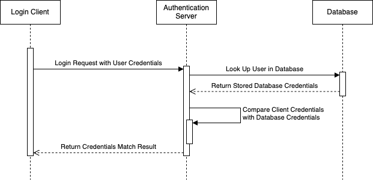

# Authentication Microservice

Processes login HTTP POST requests for matching user credentials in MongoDB database.

## Prerequisites

- Node.js installation
- MongoDB database setup, with a collection that stores user credentials

## Setup

### Package Installation

Run the following command at the root of the directory.

```
npm install
```

### Environment Setup

Create a .env file at the root of the directory and define the variables below, replacing the quoted text with your details.

```
DB_URL="<path to database>"
DB_NAME="<database name>"
DB_USER_COLL="<user collection name>"
USER_FIELD_NAME="<name of user field>"
PW_FIELD_NAME="<name of password field>"
PORT="<server port>"
```

An example .env file might look like the following.

```
DB_URL="mongodb://localhost:27017"
DB_NAME="my_project"
DB_USER_COLL="Users"
USER_FIELD_NAME="userName"
PW_FIELD_NAME="password"
PORT="3001"
```

## Starting the Service

Run the following command to start the service.

```
npm start
```

## Sending Login POST Requests and Receiving Server Response

Clients sending POST requests must include the following JSON in the request body to <the_server_address>/login.

```
{
    'username': 'some_username',
    'password': 'some_password'
}
```

Clients will receive an HTTP reponse with the following JSON format. The response will either be "true" if the user credentials match or "false" if the credentials do not match.

```
{
    "response": "true"
}
```

You can see example HTTP requests in JavaScript and Python [here](sample_usage).

## UML Sequence Diagram

